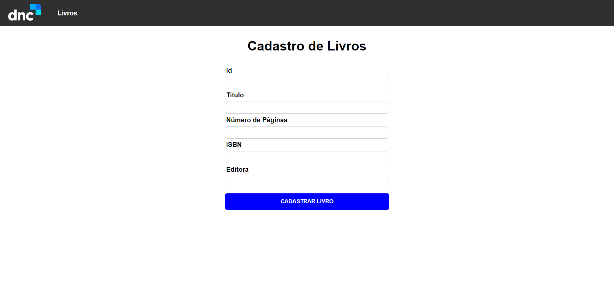

# Projeto Biblioteca - MERN

## Descrição do projeto
É um projeto MERN, um biblioteca online que você pode visualizar os livros cadastrados tal como cadastrar, editar e excluir livros.
O front end foi criado em "vite".


Tabela de conteúdos
=================
<p align="center">
 <a href="#objetivo">Objetivo</a> •
 <a href="#roadmap">Roadmap</a> • 
 <a href="#tecnologias">Tecnologias</a> • 
 <a href="#contribuicao">Contribuição</a> • 
 <a href="#licenc-a">Licença</a> • 
 <a href="#autor">Autor</a>
</p>


## Status do projeto
<h4 align="center"> 
	🚧  React Select 🚀 Já concluido  🚧
</h4>


## Demonstração do aplicativo
### Page home do projeto


### Page cadastro livro no projeto


### Page livros cadastrado do projeto


### Page editar livros do projeto


## Pré-requisitos e como rodar a aplicação/testes

### 🎲 Rodando o Front End (client)

```bash
# Clone este repositório
$ git clone https://github.com/Leandro-Pinho/projeto-biblioteca

# Acesse a pasta do projeto no terminal/cmd
$ cd projeto-biblioteca

# Vá para a pasta server
$ cd front

# Instale as dependências
$ npm install

# Execute a aplicação em modo de desenvolvimento
$ npm run dev
```


### 🎲 Rodando o Back End (servidor)

```bash
# Clone este repositório
$ git clone https://github.com/Leandro-Pinho/projeto-biblioteca

# Acesse a pasta do projeto no terminal/cmd
$ cd projeto-biblioteca

# Vá para a pasta server
$ cd server

# Instale as dependências
$ npm install

# Execute a aplicação em modo de desenvolvimento
$ npm start

# O servidor inciará na porta:8080 - acesse <http://localhost:8080>
````

### 🛠 Tecnologias

As seguintes ferramentas foram usadas na construção do projeto:

- [Vite](https://vitejs.dev/)
- [Node.js](https://nodejs.org/en/)
- [React](https://pt-br.reactjs.org/)


## Licença
MIT License

Copyright (c) <2020> <Leandro Pinho>

Permission is hereby granted, free of charge, to any person obtaining a copy
of this software and associated documentation files (the "Software"), to deal
in the Software without restriction, including without limitation the rights
to use, copy, modify, merge, publish, distribute, sublicense, and/or sell
copies of the Software, and to permit persons to whom the Software is
furnished to do so, subject to the following conditions:

The above copyright notice and this permission notice shall be included in all
copies or substantial portions of the Software.

THE SOFTWARE IS PROVIDED "AS IS", WITHOUT WARRANTY OF ANY KIND, EXPRESS OR
IMPLIED, INCLUDING BUT NOT LIMITED TO THE WARRANTIES OF MERCHANTABILITY,
FITNESS FOR A PARTICULAR PURPOSE AND NONINFRINGEMENT. IN NO EVENT SHALL THE
AUTHORS OR COPYRIGHT HOLDERS BE LIABLE FOR ANY CLAIM, DAMAGES OR OTHER
LIABILITY, WHETHER IN AN ACTION OF CONTRACT, TORT OR OTHERWISE, ARISING FROM,
OUT OF OR IN CONNECTION WITH THE SOFTWARE OR THE USE OR OTHER DEALINGS IN THE
SOFTWARE.

